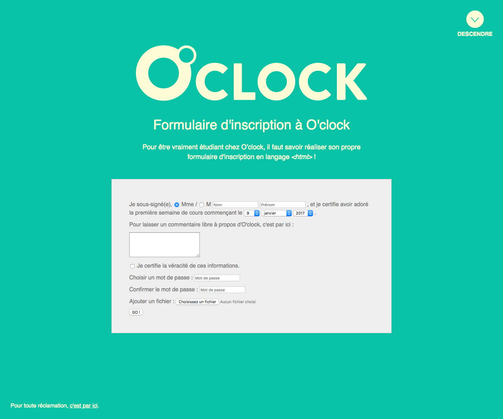

# Challenge : les formulaires HTML

## Objectif

Aujourd'hui, on a découvert Git, yahouuuu !  
Tant qu'on y est, autant continuer à découvrir des trucs cools :
**les formulaires html** !

## Instructions

* Il faut réaliser l'intégration de cette page en HTML / CSS :

* Quelques détails à savoir :
	- le lien "Descendre"en haut à droite est un "lien interne",
	et permet de descendre tout en bas de la page, à la phrase "pour toute réclamation…"

	- Le lien "c'est par ici" doit ouvrir le logiciel de mail au clic.

## Whaaat ?!

Pas de panique ! Pour découvrir les balises à utiliser, allons voir le **MDN** :
https://developer.mozilla.org/fr/docs/Web/Guide/HTML/Formulaires/Mon_premier_formulaire_HTML

Plus précisément, on va utiliser ces balises-là :
* https://developer.mozilla.org/fr/docs/Web/HTML/Element/form
* https://developer.mozilla.org/fr/docs/Web/HTML/Element/label
* https://developer.mozilla.org/fr/docs/Web/HTML/Element/input
* https://developer.mozilla.org/fr/docs/Web/HTML/Element/textarea
* https://developer.mozilla.org/fr/docs/Web/HTML/Element/button
